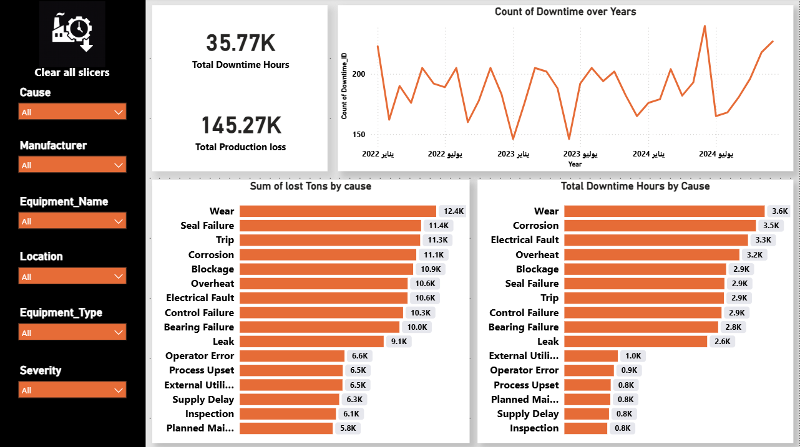
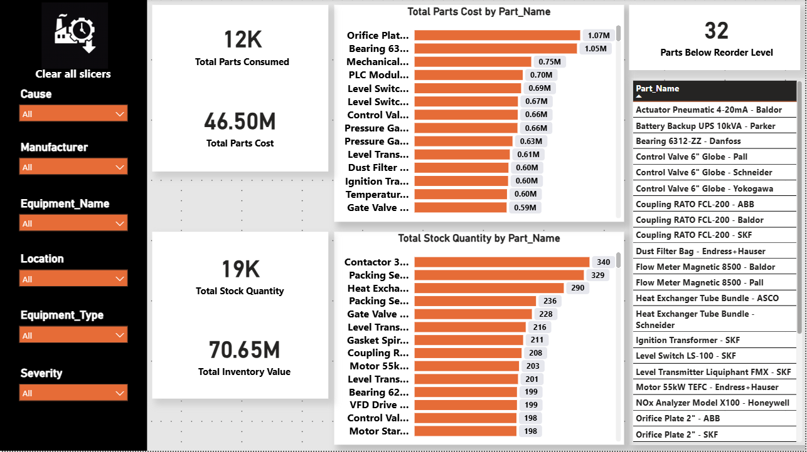
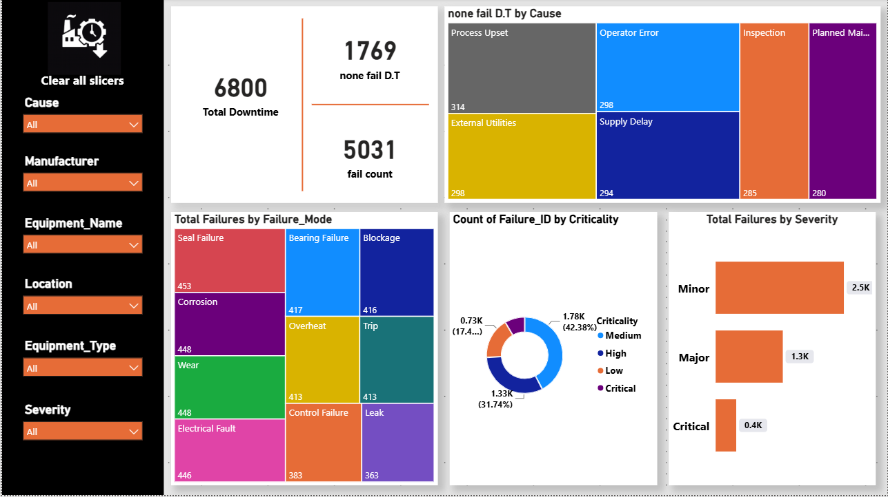
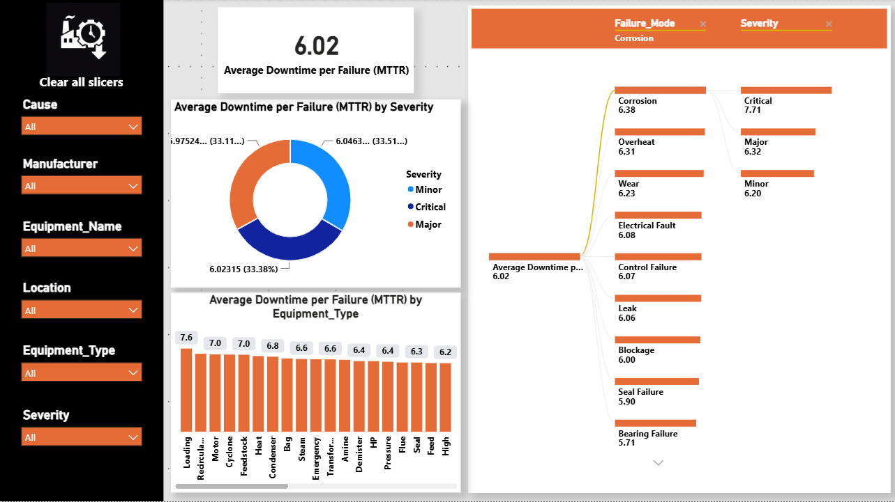
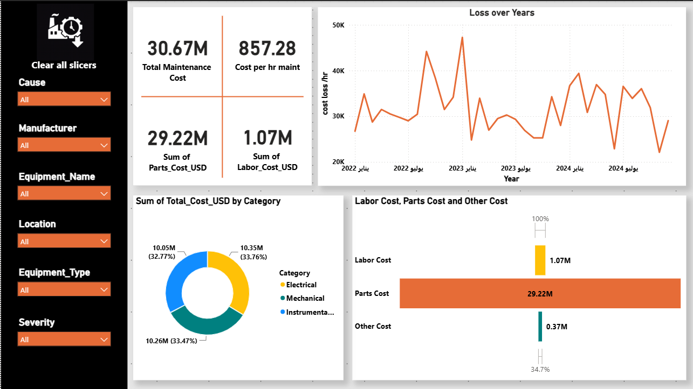
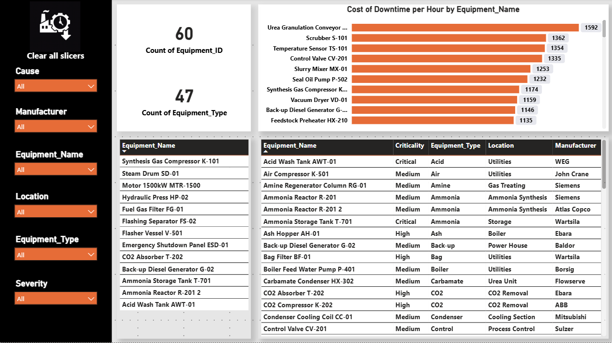

# 🏭 Manufacturing & Production Analytics Dashboard

## 📊 Dashboard Preview

### Executive Overview

### Inventory Analysis

### Failure Analysis

### Failure Pattern & Reliability Analysis

### Maintenance Cost Analysis

### Equipment Performance Analysis

---

# 📌 Project Overview

An end-to-end Manufacturing Analytics solution built to analyze equipment reliability, production downtime, maintenance performance, spare parts inventory, and operational costs.

The dashboard transforms maintenance and operational data into actionable insights to support data-driven decisions for Operations, Maintenance, and Finance teams.

---

# 🎯 Business Objective

The objective of this project is to:

- Analyze the root causes of manufacturing downtime.
- Identify high-impact equipment and failure patterns.
- Evaluate maintenance cost drivers.
- Optimize spare parts inventory management.
- Improve equipment reliability and operational efficiency.

---

# 📊 Data Source

The dataset represents an integrated maintenance management system containing multiple operational tables:

### Downtime Records
- Downtime events
- Failure causes
- Production loss
- Downtime duration

### Failure Records
- Failure mode
- Failure severity
- Equipment information
- Failure frequency

### Maintenance Data
- Parts cost
- Labor cost
- Other maintenance expenses
- Total maintenance cost

### Inventory Data
- Spare parts quantity
- Parts consumption
- Inventory value
- Reorder level

---

# 🔍 Analytical Process

## Data Preparation & Modeling

- Cleaned and transformed raw operational data.
- Built relationships between equipment, failures, maintenance, and inventory tables.
- Created an analytical data model optimized for Power BI reporting.

## KPI Development

Developed business KPIs across three main areas:

### Reliability KPIs
- Total Failures
- Total Downtime Hours
- Average Downtime per Failure (MTTR Proxy)
- Failure Severity Analysis

### Cost KPIs
- Total Maintenance Cost
- Parts Cost
- Labor Cost
- Cost of Downtime

### Inventory KPIs
- Total Stock Quantity
- Inventory Value
- Parts Below Reorder Level

---

# 📈 Dashboard Pages

## 1. Overview Dashboard

Provides an executive summary of:

- Downtime performance
- Failure trends
- Production impact
- Critical metrics

## 2. Inventory Analysis

Focuses on:

- Spare parts consumption
- Stock levels
- Inventory value
- Reorder risks

## 3. Failure Analysis

Analyzes:

- Failure causes
- Failure modes
- Severity distribution
- Criticality levels

## 4. Reliability Analysis

Evaluates:

- MTTR trends
- Equipment reliability
- Failure patterns
- High-risk assets

## 5. Cost Analysis

Analyzes:

- Maintenance expenditure
- Cost distribution
- Cost trends
- Major cost contributors

## 6. Equipment Performance Analysis

Provides insights into:

- Equipment criticality
- Manufacturer performance
- Asset-level analysis
- Downtime contribution

---

# 🔍 Key Business Insights

- Wear, corrosion, and seal failure were identified as major contributors to downtime.
- A small number of equipment assets generated a significant portion of downtime impact.
- Parts cost represented the largest component of maintenance expenditure.
- Inventory analysis highlighted spare parts requiring better stock optimization.
- Critical equipment should be prioritized for preventive maintenance strategies.

---

# 💡 Business Recommendations

- Implement preventive maintenance programs based on failure history.
- Prioritize high-impact equipment for reliability improvement.
- Optimize spare parts inventory using consumption and criticality analysis.
- Continuously monitor downtime trends to reduce production losses.

---

# 🛠 Tools & Technologies

- Microsoft Power BI
  - Data Modeling
  - DAX Measures
  - Interactive Dashboards

- Microsoft Excel
  - Data Preparation
  - Data Cleaning

---

# 👥 Target Stakeholders

Designed for:

- Operations Managers
- Maintenance Teams
- Reliability Engineers
- Finance Teams

---

# 📌 Project Outcome

This project demonstrates how industrial data can be transformed into actionable business intelligence to improve reliability, reduce downtime, control maintenance costs, and support operational decision-making.
