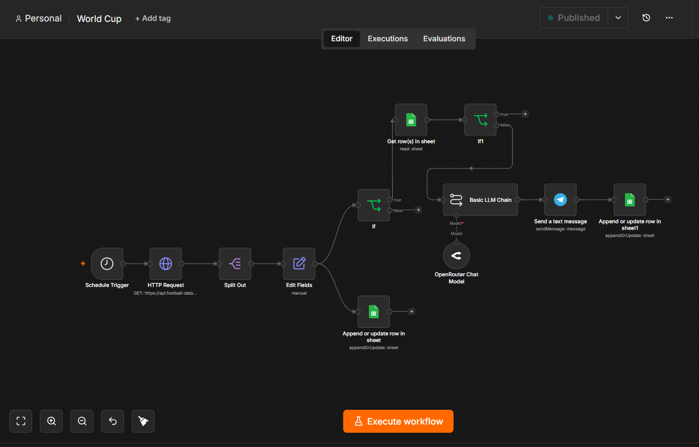
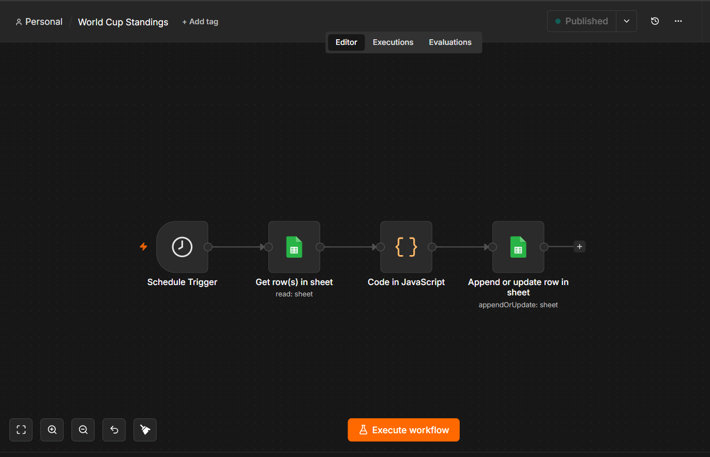

# AI-Powered FIFA World Cup Analytics & Automation System
# 📊 Project Overview

An AI-powered automation platform built to monitor FIFA World Cup matches, generate AI-based match summaries, track standings and qualification scenarios, and deliver real-time notifications automatically.

## ⚙️ Main Workflow

## 📊 Standings & Qualification Workflow

# 📌 Business Objective

Build a fully automated football analytics system capable of:

1. Collecting live match data.
2. Maintaining tournament standings.
3. Tracking qualified teams and best third-placed teams.
4. Generating AI-powered match summaries.
5. Sending real-time Telegram notifications.

# 📊 Data Source
1. Football-Data API
2. Live FIFA World Cup match data
3. Group stage standings and qualification information

# 🔍 Automation & Analytics Process
# Match Data Collection
1. Retrieved live match data using Football-Data API.
2. Automated data ingestion through n8n workflows.
# Data Repository
1. Stored match results and tournament data in Google Sheets.
2. Maintained live standings and qualification tables.
### Match Data Repository

# Qualification Logic
Automatically calculated:
1. Group standings.
2. Qualified teams.
3. Best third-placed teams.
### Tournament Standings

### Qualified Teams

### Best Third-Placed Teams

# AI Match Analysis
1. Integrated OpenRouter AI.
2. Generated automated match summaries and insights.
# Notification System
1. Delivered real-time Telegram notifications.
2. Prevented duplicate alerts using tracking logic.

# 📈 Key Features
1. Real-time tournament monitoring.
2. Automated standings calculation.
3. Qualification tracking engine.
4. Best third-placed team ranking.
5. AI-generated match summaries.
6. Telegram notification automation.
7. Cloud deployment with n8n.

# 🛠 Tools & Technologies
1. n8n Cloud
2. Football-Data API
3. OpenRouter AI
4. Google Sheets Formulas
5. Telegram Bot API
6. JavaScript
7. REST APIs

# 🚀 Future Enhancements
1. Power BI Dashboard Integration
2. Historical Tournament Analytics
3. Team Performance Dashboards
4. Predictive Match Outcome Models
