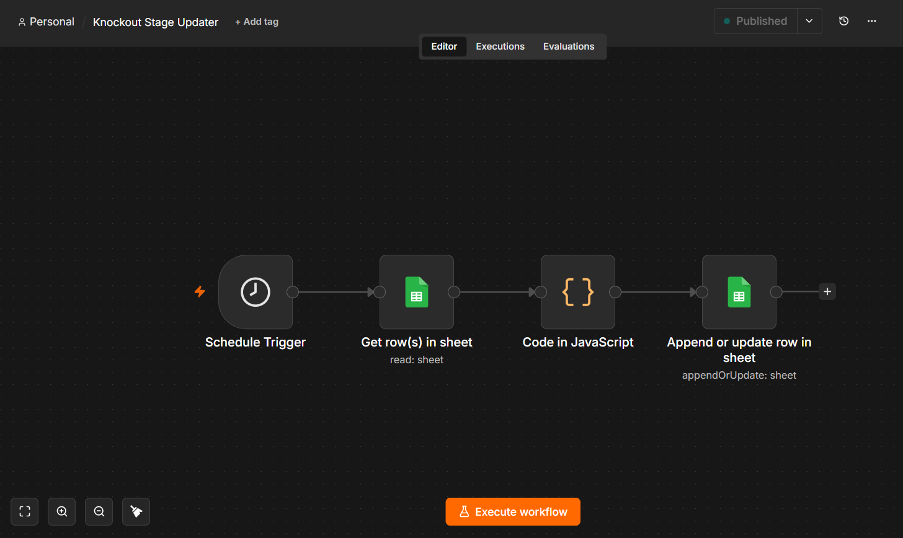

# AI-Powered FIFA World Cup Analytics & Automation System

# 📊 Project Overview

An AI-powered football analytics and automation platform designed to monitor FIFA World Cup matches, process tournament data, calculate standings and qualification scenarios, generate AI-based match insights, and deliver automated real-time notifications.

The system combines data automation, analytics logic, AI integration, and workflow orchestration to create an end-to-end tournament monitoring solution.

---

# ⚙️ Automation Workflows

The platform is powered by n8n automation workflows responsible for collecting, processing, and updating tournament data.

## Main Data Collection Workflow

## Standings Calculation Workflow

## Knockout Stage Update Workflow

---

# 📌 Business Objective

Build an automated football analytics system capable of:

1. Collecting live FIFA World Cup match data.
2. Maintaining accurate tournament standings.
3. Tracking qualification scenarios.
4. Managing knockout stage progression.
5. Generating AI-powered match summaries.
6. Sending automated Telegram notifications.

---

# 📊 Data Sources

The system uses:

1. Football-Data API
2. Live FIFA World Cup match data
3. Tournament standings and qualification information

---

# 🔍 Automation & Analytics Process

## Match Data Collection

- Retrieved match information from football APIs.
- Automated data ingestion and processing using n8n workflows.
- Structured match data for analytics and reporting.

---

# 📂 Data Repository

Tournament data is stored and managed using Google Sheets as the central data layer.

The repository contains:

- Match data
- Group standings
- Qualified teams
- Best third-placed teams
- Knockout stage results

## Match Data Repository

## Tournament Standings

## Qualified Teams

## Best Third-Placed Teams

---

# 🏆 Knockout Stage Tracking

The system was extended to support knockout stage monitoring including:

- Round of 32
- Round of 16
- Quarter-finals
- Semi-finals
- Third-place match
- Final

The knockout stage workflow automatically updates match results, winners, and tournament progression.

## Knockout Stage Repository

---

# 🤖 AI Match Analysis

- Integrated OpenRouter AI models for automated match analysis.
- Generated match summaries including:
  - Match overview
  - Key takeaways
  - Tournament implications

---

# 📢 Notification System

Automated Telegram notification system responsible for:

- Sending real-time match updates.
- Delivering AI-generated summaries.
- Preventing duplicate notifications using tracking logic.

---

# 📈 Key Features

✅ Real-time tournament monitoring  
✅ Automated match data collection  
✅ Dynamic standings calculation  
✅ Qualification scenario tracking  
✅ Best third-placed team ranking  
✅ Knockout stage progression tracking  
✅ AI-generated match analysis  
✅ Telegram notification automation  
✅ n8n workflow orchestration  

---

# 🛠 Tools & Technologies

- n8n Cloud
- Football Data APIs
- OpenRouter AI
- Google Sheets
- Telegram Bot API
- JavaScript
- REST APIs

---

# 🚀 Future Enhancements

1. Power BI Interactive Dashboard
2. Historical World Cup Analytics
3. Team Performance Analytics
4. Predictive Match Outcome Models
5. Advanced football metrics and visualizations
