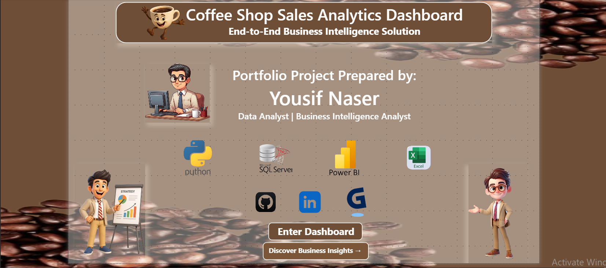

# ☕ Coffee Shop Sales Analytics

<p align="center">
  
</p>

## End-to-End Business Intelligence Platform

An enterprise-style Business Intelligence platform that automates data ingestion, validation, cleaning, SQL loading, and executive reporting using **Python, n8n, SQL Server, and Power BI**.

This project demonstrates the complete Business Intelligence lifecycle, starting from raw sales data and ending with executive dashboards and actionable business insights through an automated ETL pipeline.

---

# 🚀 Project Overview

Unlike traditional Power BI portfolio projects that focus only on dashboard development, this project simulates a real-world enterprise BI solution.

The solution automates the entire data preparation process, including:

- Automated data validation
- Python-based data cleaning
- SQL Server staging & production loading
- Pipeline audit logging
- Human approval workflow
- Executive Power BI reporting

---

# 🏗️ Project Architecture

```text
Raw Dataset (Excel / CSV)
        │
        ▼
Google Drive
        │
        ▼
n8n Automation
        │
        ▼
Python Processing Engine
        │
        ▼
SQL Server
 ├── Staging Table
 ├── Pipeline Audit Log
 └── Production Table
        │
        ▼
Power BI Dashboard
```

---

# ⚙️ Technologies Used

- Power BI
- DAX
- Power Query
- SQL Server
- Python
- FastAPI
- Pandas
- NumPy
- n8n
- Google Drive API
- Gmail API

---

# 🔄 Data Pipeline

The automated pipeline performs the following steps:

- Detects newly uploaded datasets from Google Drive.
- Validates dataset structure and business rules.
- Cleans and standardizes raw data using Python.
- Generates data quality reports.
- Loads validated data into SQL Server staging tables.
- Moves approved data into production tables.
- Maintains audit logs for every pipeline execution.
- Updates the Power BI reporting dataset.
- Sends automated notifications after processing.

---

# 📊 Dashboard Pages

- Executive Dashboard
- Sales Analysis
- Product Analysis
- Pareto Analysis (80/20 Rule)
- Store Performance
- Time Analysis

---

# 📈 Dashboard Features

- Executive KPI Cards
- Interactive Slicers
- Drill-through Navigation
- Dynamic Tooltips
- Dynamic Rankings
- Business Insights Popup
- Conditional Formatting
- Running Total Analysis
- Time Intelligence
- Pareto Analysis
- ABC Classification
- Revenue Contribution Analysis
- Store Performance Comparison

---

# ❓ Business Questions Answered

The dashboard answers important business questions including:

- Which store generates the highest revenue?
- Which products contribute to 80% of total revenue?
- Which products should be prioritized?
- Which products belong to A, B, and C classifications?
- Which store has the highest Average Order Value?
- What are the busiest sales hours?
- How does revenue change over time?
- Which products require business attention?
- How do stores compare in overall performance?

---

# 📁 Repository Structure

```text
09-Coffee-Shop-Sales-Analytics
│
├── Dashboard
├── Dataset
├── Python
├── SQL-Server
├── n8n Workflow
├── Power BI
├── BusinessInsights.md
└── README.md
```

---

# 🖼️ Dashboard Preview

Dashboard screenshots are available inside the **Dashboard** folder.

The project includes multiple report pages covering:

- Executive Dashboard
- Sales Performance
- Product Performance
- Store Performance
- Time Analysis
- Pareto Analysis

---

# 🤖 Automation Workflow

The automation layer consists of two integrated workflows:

### AI Data Analysis Pipeline

- Google Drive Trigger
- File Validation
- Python Processing
- SQL Server Loading
- Audit Logging
- Report Generation
- Email Notifications

### Human Approval Workflow

- Approval Decision
- Production Verification
- SQL Update
- Audit Update
- Report Packaging
- Google Drive Upload
- Email Delivery

---

# 💾 Dataset Information

| Metric | Value |
|---------|------:|
| Period | January 2023 – June 2023 |
| Transactions | 149,116 |
| Stores | 3 |
| Products | 80 |
| Categories | 9 |

---

# 🎯 Project Highlights

- End-to-End Business Intelligence Solution
- Automated ETL Pipeline
- Google Drive Integration
- Python Cleaning Framework
- Data Validation Engine
- SQL Server Staging & Production Architecture
- Pipeline Audit Logging
- Human Approval Workflow
- Executive Power BI Dashboard
- Business KPI Monitoring
- Dynamic Reporting
- Business Storytelling

---

# 🛠️ Skills Demonstrated

### Business Intelligence

- Power BI
- DAX
- Power Query
- Executive Reporting
- KPI Design
- Dashboard Development

### Data Engineering

- Python
- FastAPI
- Data Cleaning
- Data Validation
- ETL Automation
- SQL Server
- n8n Workflow Automation

### Analytics

- Pareto Analysis
- ABC Classification
- Revenue Analysis
- Time Intelligence
- Store Performance Analysis
- Product Performance Analysis

---

# 💼 Business Value

This solution automates the data preparation and reporting process, significantly reducing manual effort while improving data quality through validation, audit logging, approval workflows, and automated reporting before data reaches Power BI.

The platform demonstrates how enterprise Business Intelligence solutions are designed to support reliable, scalable, and data-driven decision-making.

---

# ⭐ Why This Project?

Unlike traditional Power BI portfolio projects that focus only on dashboard development, this project demonstrates the complete Business Intelligence lifecycle—from raw data ingestion and validation to automated ETL processing, SQL Server integration, workflow automation, and executive reporting.

The solution reflects how enterprise BI platforms are built in real business environments using modern Business Intelligence practices.
